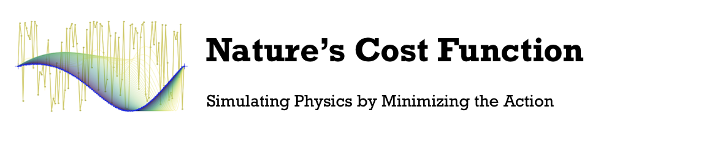

Is the mathematical overlap between physics and optimization a fortuitous surface-level similarity or does it point to something about the fundamental structure of the natural world? We investigate this question by blurring the lines, computationally, between simulation and optimization. We begin with a scalar quantity known as "the action" in physics. It behaves like a cost function for physical systems. By directly minimizing this quantity with gradient descent, we obtain paths of stationary (least) action which correspond to valid physical trajectories. We demonstrate our approach on a free body, a pendulum, a double pendulum, the three body problem, a gas simulation, the planetary ephemerides, and a quantum wave packet simulation. Then we show that our approach is amenable to ODE super-resolution. Finally, we show how multiple paths interfere with one another at the quantum scale. This forces us to take into account many paths at once and gives rise to the path integral formulation of quantum mechanics.

## How to run

* Jupyter notebook
	* Open `main.ipnyb` which is located in this directory
* Command line
	* Navigate to the directory containing this README
	* Run, eg. `python main.py --experiment dblpend`
	* Note: `--experiment` is one of {`freebody`, `singlepend`, `doublepend`, `threebody`, `gas`, `ephemeris`}

## Simulations

* Free body
	* Minimal working example
* Single Pendulum
	* Minimal working example with nonlinearities and radial coordinates
* Double pendulum
	* A chaotic system with sharp nonlinear dynamics
* Three body problem
	* A chaotic system with sharp nonlinear dynamics and N=6 degrees of freedom
* Gas simulation
	* * A chaotic system with sharp nonlinear dynamics and N=400 degrees of freedom
* Ephemeris dataset
	* A real physics data taken from the JPL Horizons project
	* One year of orbital data for the sun and the inner planets of the solar system
	* Orbits are projected onto a 2D plane

## Depedencies

* PyTorch `pip install torch` <3
* Pandas `pip install pandas` <3
* Celluloid (making videos) `pip install celluloid` <3
